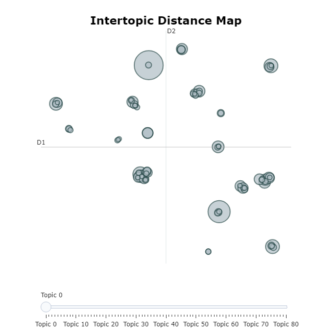
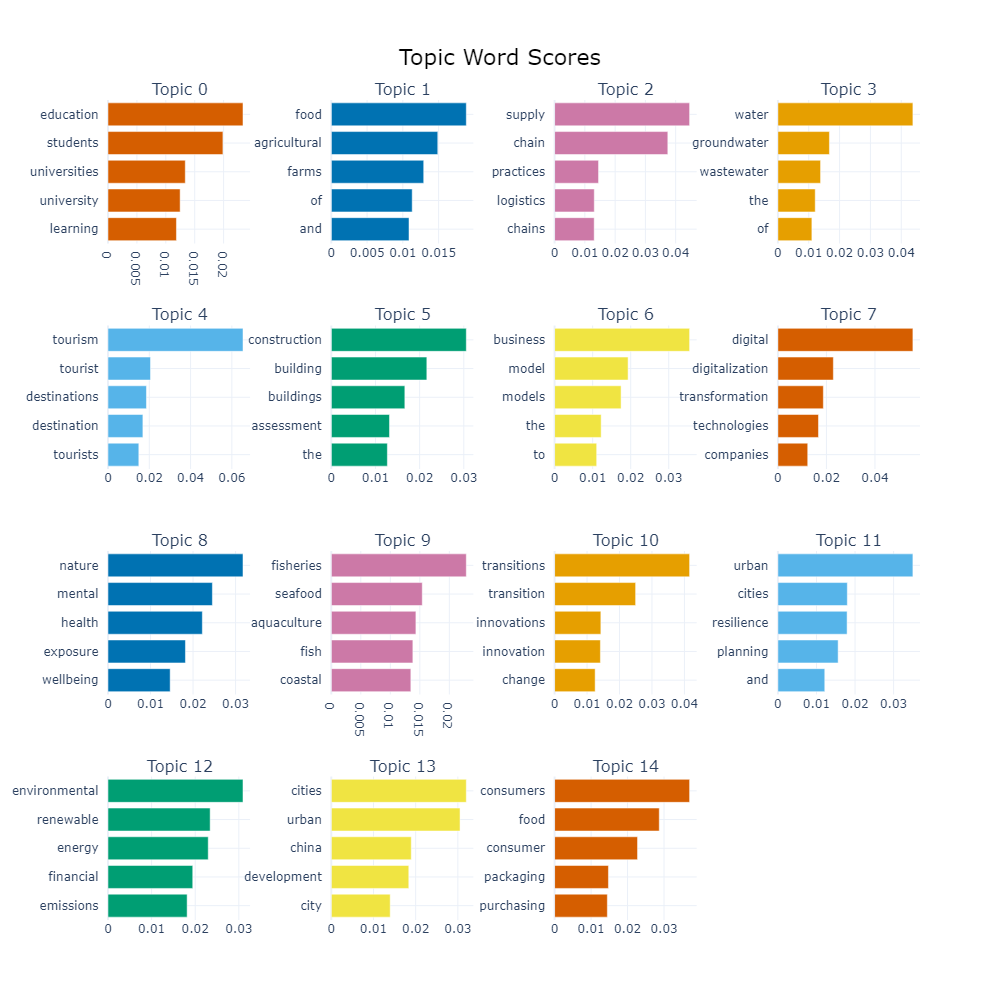
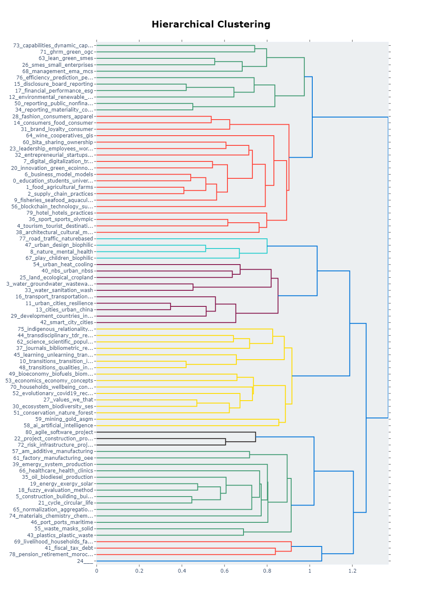
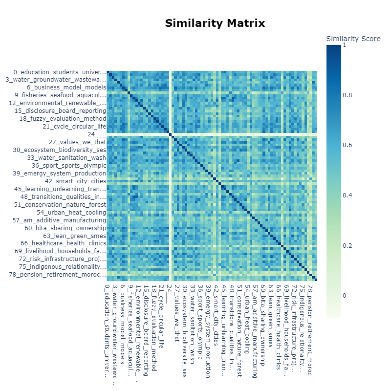
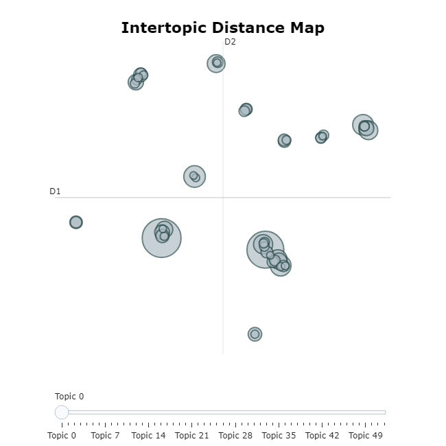
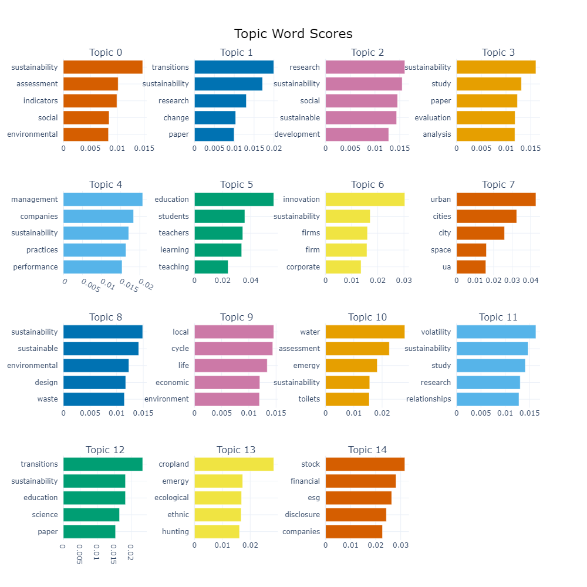
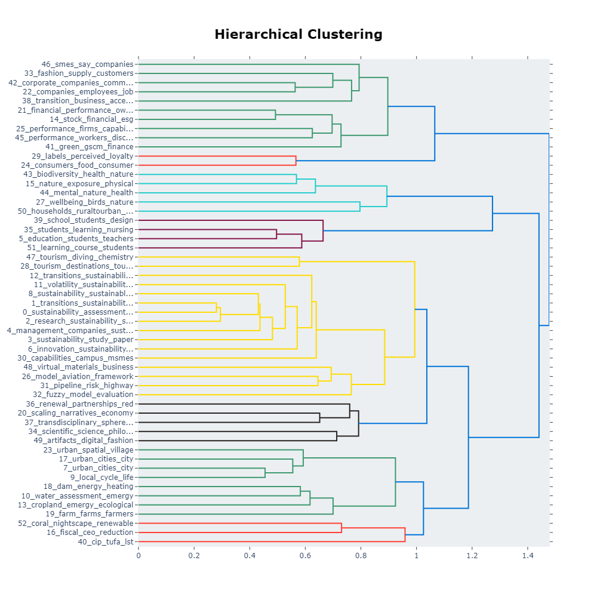
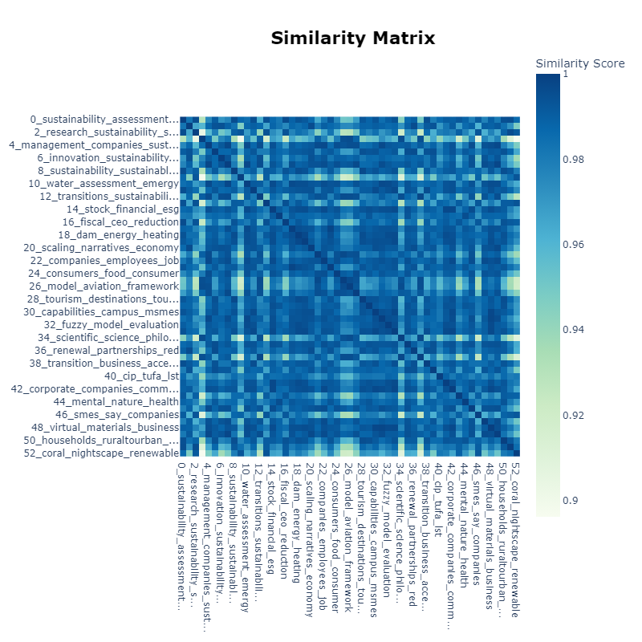

# ReCoDE - Analysis of environmental literature with BERTopic and RoBERTa

## Explosive literature in Environmental and Sustainability Studies

The field of **environmental and sustainability** studies has witnessed an explosive growth in literature over the past few decades, driven by the increasing global awareness and urgency surrounding environmental issues, climate change, and the need for sustainable practices.

This rapidly expanding body of literature is characterized by its **interdisciplinary nature**, encompassing a wide range of disciplines such as ecology, climate science, energy, economics, policy, sociology, and more. With a global focus and contributions from countries around the world, the literature base reflects **diverse cultural, socio-economic, and geographical contexts**, often in multiple languages. **Novel research areas and emerging topics**, such as circular economy, sustainable urban planning, environmental justice, biodiversity conservation, renewable energy technologies, and ecosystem services, continue to arise as environmental challenges evolve and our understanding deepens. The **development of environmental policies**, regulations, and international agreements, as well as increased public interest and awareness, have further fueled research and the demand for literature aimed at informing and engaging various stakeholders. **Technological advancements** in areas like remote sensing, environmental monitoring, and computational modelling have enabled new avenues of research and data-driven studies, contributing to the proliferation of literature. **The rise of open access publishing and digital platforms** has facilitated the dissemination and accessibility of this constantly evolving and interdisciplinary body of knowledge.

So, in summary, the explosive growth of the literature across multiple disciplines, geographic regions, languages, and emerging topics poses significant challenges in terms of effectively organizing, synthesizing, and extracting insights from this vast and rapidly expanding body of knowledge. This is where **Natural Language Processing (NLP)** techniques like **topic modelling** with BERTopic and advanced language models like RoBERTa can play a crucial role. Their ability to process large volumes of text data, identify semantic topics and patterns, cluster related documents, and handle multiple languages can help researchers, policymakers, and stakeholders navigate this extensive literature more effectively.

**Furthermore, as a STEMM PhD student at Imperial stepping into a new field such as Sustainability, taking advantage of the NLP tools can significantly enhance the efficiency of literature exploration and review. This skill facilitates a seamless transition into interdisciplinary research, empowering you to navigate diverse datasets and extract valuable insights with greater ease and precision.**

## The Potential of Topic Modelling

Topic modelling is a technique in NLP and machine learning used to discover abstract "topics" that occur in a collection of documents. The key idea is that documents are made up of mixtures of topics, and that each topic is a probability distribution over words.

More specifically, topic modelling algorithms like Latent Dirichlet Allocation (LDA) work by:

1. Taking a set of text documents as input.
2. Learning the topics contained in those documents in an unsupervised way. Each topic is represented as a distribution over the words that describe that topic.
3. Assigning each document a mixture of topics with different weights/proportions.

For example, if you ran topic modelling on a set of news articles, it may discover topics like "politics", "sports", "technology", etc. The "politics" topic would be made up of words like "government", "election", "policy" with high probabilities. Each document would then be characterized as a mixture of different proportions of these topics.

The key benefits of topic modelling include:

1. Automatically discovering topics without need for labeled data
2. Understanding the themes/concepts contained in large document collections
3. Organizing, searching, and navigating over a document corpus by topics
4. Providing low-dimensional representations of documents based on their topics

Topic modelling has found applications in areas like **information retrieval, exploratory data analysis, document clustering and classification, recommendation systems**, and more. Popular implementations include Latent Dirichlet Allocation (LDA), Biterm Topic Model (BTM), and techniques leveraging neural embeddings like BERTopic.

## Learning Outcomes

By the end of this tutorial, students will be able to acquire the following learning outcomes:

1. Proficiency in Text Data Preprocessing: Participants will gain hands-on experience in preprocessing environmental literature datasets, including cleaning, tokenisation, and normalisation techniques, essential for preparing data for NLP analysis.

2. Understanding the principle of embedding-matrix-based NLP techniques: Through the application of BERTopic for topic modelling and RoBERTa for sentiment analysis, students will develop a deep understanding of advanced NLP methods and their practical implementation in dissecting environmental and sustainability texts and beyond.

3. Critical Analysis Skills: Participants will learn to critically analyse and interpret the results of NLP analyses, including identifying dominant themes, sentiment shifts, and trends in environmental literature, fostering a nuanced understanding of environmental discourse.

4. Interpretation and Application: Relying on a real-world example, this project demonstrates how to generate visualisations and reports to present the results of the topic modelling and sentiment analysis, facilitating interpretation and discussion.

## Requirements

It would help a lot if you went through the following Graduate School courses before going through this exemplar:
* [Introduction to Python](https://www.imperial.ac.uk/students/academic-support/graduate-school/professional-development/doctoral-students/research-computing-data-science/courses/intro-to-python/)
* [Data Exploration and Visualisation](https://www.imperial.ac.uk/students/academic-support/graduate-school/professional-development/doctoral-students/research-computing-data-science/courses/data-exploration-visualisation/)
* [Data Processing with Python Pandas](https://www.imperial.ac.uk/students/academic-support/graduate-school/professional-development/doctoral-students/research-computing-data-science/courses/data-processing-python-pandas/)
* [Plotting in Python with Matplotlib](https://www.imperial.ac.uk/students/academic-support/graduate-school/professional-development/doctoral-students/research-computing-data-science/courses/plotting-in-python-with-matplotlib/)
* [Binary Classification of Patent Text Using Natural Language Processing (another ReCoDE project)](https://github.com/ImperialCollegeLondon/ReCoDE-AIForPatents)

## Academic

* Access to Google Colaboratory
* Basic Math (matrices, averages)
* Programming skills (python, pandas, numpy, tensorflow)
* Machine learning theory (at level of intro to machine learning course)

## System

Windows

## Getting Started

### Colab

Please visit this Colab page to access the detailed content of this tutorial: https://colab.research.google.com/drive/1vJzmFTFurlK-NGDw_fhJgxSmcKSZooLn?usp=sharing

<a href="https://colab.research.google.com/drive/1vJzmFTFurlK-NGDw_fhJgxSmcKSZooLn#scrollTo=GWrz9R6rhhbc">  </a>

### A Step-by-Step Case Study using BERTopic to Analyze One web of Science Dataset

In this step-by-step case study, we will focus on the application of BERTopic, to analyze a sample dataset sourced from Web of Science. Through this tutorial, we aim to guide you through the process:

 * Installation and setup of BERTopic
 * Collecting the raw data and preprocessing the dataset
 * Implementing BERTopic for topic modeling
 * Visualizing the inferred topics and interpreting the results
 * Fine-tuning topic representations
 * Additional readings about the wider application of BERTopic

By following along, you will gain practical insights into leveraging BERTopic for insightful analysis of scholarly literature from Web of Science.

Some sample visualisation results can be:





### A Step-by-Step Case Study using RoBERTa

Similart to what we have done above, we need to follow the following steps when applying a RoBERTa model.

 * RoBERTa Initialization: Initializes RoBERTa tokenizer and model
 * Data Preparation: Loads and preprocesses the dataset
 * Batch Tokenization: Tokenizes abstracts in batches
 * Embedding Generation: Generates embeddings using RoBERTa, and save it
 * Topic Modeling: Applies BERTopic with RoBERTa embeddings
 * Improve and fine-tune
 * Visualization

This section focuses on integrating RoBERTa into the topic modeling pipeline, enhancing its analytical capabilities.

Some sample visualisation results can be:





## Frequently Asked Questions and Best Practices (All details can be found on the Colab page)
https://colab.research.google.com/drive/1vJzmFTFurlK-NGDw_fhJgxSmcKSZooLn#scrollTo=SbhVeLI72Idj&line=1&uniqifier=1 

1. Specify a preferred hardware accelerator on Colab
2. Besides Web of Science, where else can I find datasets, and how can I import literature datasets in bulk across platforms?
3. Can I publish the textual dataset I pre-processed, and where？
4. Why do we need to explore literature and compared to manual exploration, what are the advantages of applying models like BERT?
5. Factors helping you decide whether to apply RoBERTa (if you have used a general BERToic model):
6. Why is preprocessing necessary when using RoBERTa but not always required when using BERTopic？
7. Why is it necessary to pretrain a RoBERTa model?
8. What happens next after pretraining?

## Further Reading

 * The BERTopic developer's github page: https://github.com/MaartenGr/BERTopic
 * The BERTopic developer's personal blog page: https://www.maartengrootendorst.com/
 * Tutorial page - Leveraging BERT and c-TF-IDF to create easily interpretable topics: maartengr.github.io/BERTopic/
 * Natural Language Processing: A Textbook with Python Implementation (by Raymond S. T. Lee): https://www.amazon.co.uk/Natural-Language-Processing-Textbook-Implementation-ebook/dp/B0CBR29GV2
 * Speech and Language Processing (3rd ed. draft) (by Dan Jurafsky and James H. Martin): https://web.stanford.edu/~jurafsky/slp3/
 * Multi-lingual and multi-modal topic modelling with pre-trained embeddings: https://aclanthology.org/2022.coling-1.355.pdf


<!-- An overview of the files and folder in the exemplar.
Not all files and directories need to be listed, just the important
sections of your project, like the learning material, the code, the tests, etc.

A good starting point is using the command `tree` in a terminal(Unix),
copying its output and then removing the unimportant parts.

You can use ellipsis (...) to suggest that there are more files or folders
in a tree node.

-->

## Project Structure

```log
.
├── .github                   <- github Actions workflows
│
├── docs                      <- documents
│   ├── .icons/logos             <- icon
│   ├── datasets                 <- raw datasets
│       │── Web_of_Science_Query May 07 2024_1-5000.csv
│       │── Web_of_Science_Search_1-1000 results.csv
│       │── Web_of_Science_Search_1001-2000 results.csv
│       │── Web_of_Science_Search_2001-3000 results.csv
│       │── Web_of_Science_Search_3001-4000 results.csv
│       │── Web_of_Science_Search_4001-5000 results.csv
│   ├── plots                 <- plots
│       │── hier_cluster_bert_1.png
│       │── hier_cluster_roberta_1.png
│       │── hier_cluster_roberta_2.png
│       │── inter-topic_bert1.png
│       │── inter-topic_roberta1.png
│       │── inter-topic_roberta2.png
│       │── sim_max_bert_1.png
│       │── sim_max_roberta_2.png
│       │── top_topics_bert_1.png
│       │── top_topics_roberta_2.png
├── notebooks                 <- project data
│       ├── ReCoDE_Analysis_of_environmental_literature_with_BERTopic_and_RoBERTa.ipynb          <- Saved .ipynb file from colab
│       ├── ReCoDE-BERTopic&RoBERTa_Run on HPC at Imperial.ipynb                                 <- Saved .ipynb file suitable for running on High-Performance Computer
├── mkdocs.yml                
├── requirements.txt          <- file for installing python dependencies
├── LICENSE.md
└── README.md

```

<!-- Change this to your License. Make sure you have added the file on GitHub -->

## License

This project is licensed under the [BSD-3-Clause license](LICENSE.md)

